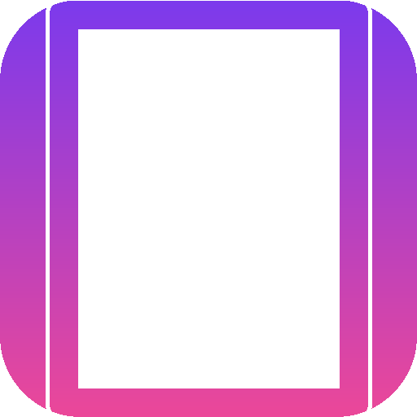

# 📸 FrameCraft

**Beautiful screenshots in seconds.**

Upload a screenshot, pick a gradient background, add a device frame, round the corners, annotate with arrows — then export or copy to clipboard. All in the browser. No uploads. No accounts.

<p align="center">
  
</p>

---

## ✨ Features

| Feature | Description |
|---|---|
| 🎨 **8 Gradient Backgrounds** | Purple Haze, Ocean Blue, Sunset, Mint, Midnight, Rose Gold, Amber Glow, Slate |
| 📱 **6 Device Frames** | iPhone, MacBook, Browser window, Shadow Box, Polaroid, No Frame |
| 🔲 **Rounded Corners** | Slider from 0–40px |
| 🌑 **Shadow Toggle** | Drop shadow behind the screenshot |
| ↗️ **Arrow Annotations** | Tap and drag to draw labeled arrows |
| 📥 **Export PNG** | One-tap download |
| 📋 **Copy to Clipboard** | Paste directly into Slack, Twitter, docs |
| 🖱️ **Paste from Clipboard** | Cmd+V a screenshot to start |
| 📱 **PWA** | Install on any device |
| 🚫 **No Uploads** | Everything happens client-side — your screenshots never leave your device |

---

## 🚀 Quick Start

```bash
python3 -m http.server 8080 -d screenshot-beautifier
# Open http://localhost:8080
```

Drop a screenshot or paste from clipboard to get started.

---

## 🎯 Use Cases

- **Product launches** — Frame app screenshots for landing pages
- **Social media** — Make tweets and posts pop with branded backgrounds
- **Bug reports** — Annotate screenshots with arrows pointing to issues
- **Documentation** — Frame UI screenshots for guides and READMEs
- **Design feedback** — Arrow annotations for precise design review

---

## 💰 Monetization

| Tier | Price | Features |
|---|---|---|
| Free | $0 | 3 exports, subtle "Made with FrameCraft" watermark |
| Pro | $2.99 lifetime | Unlimited exports, no watermark |

---

## 🧩 Architecture

```
screenshot-beautifier/
├── index.html         # Complete app — inline CSS + JS
├── manifest.json      # PWA manifest
├── sw.js              # Service worker (offline)
└── assets/
    ├── icon-192.png   # PWA icon
    └── icon-512.png   # PWA icon
```

Single-file PWA — no dependencies, no build step. Canvas-based rendering for all frames and backgrounds.

---

## 📄 License

MIT

---

<p align="center"><b>Built by <a href="https://github.com/Nezam-Seraj">Nezam Seraj</a></b></p>
